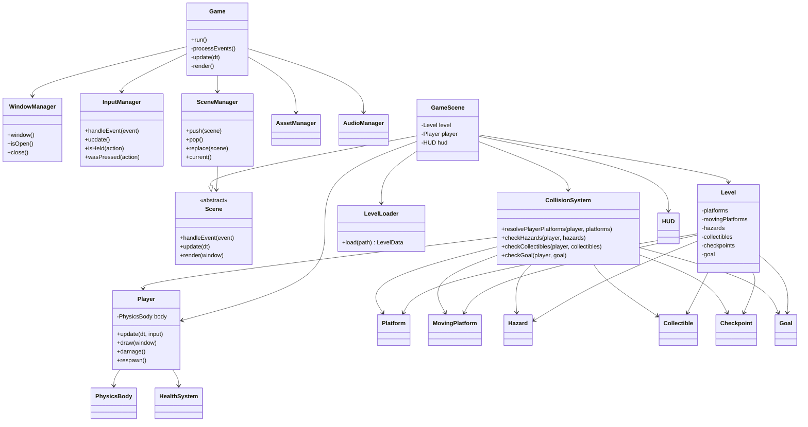

# Bounce Adventure - Phase 1 Architecture

## Objective

Define the architecture for a complete C++17 / SFML 2.6+ platformer inspired by the classic Bounce games.

Phase 1 establishes:

- Folder structure
- Engine system list
- Gameplay system list
- UI system list
- Class list
- Class diagram
- Dependency map
- Level progression plan

No gameplay implementation code is included in this phase.

## Design

Bounce Adventure is a scene-driven 2D platformer where the player controls a physics-based bouncing ball through exactly six playable levels. The game is built around focused systems rather than one large monolithic game class.

The architecture separates:

- Engine lifetime and infrastructure
- Scene ownership and transitions
- Level loading and object spawning
- Entity behavior
- Collision and physics helpers
- UI presentation
- Asset and audio access

The first implementation milestone will build the engine foundation before gameplay systems are introduced.

## File Structure

```text
BounceAdventure/
├── CMakeLists.txt
├── README.md
├── assets/
│   ├── audio/
│   │   ├── music/
│   │   └── sfx/
│   ├── fonts/
│   ├── levels/
│   │   ├── level_01.txt
│   │   ├── level_02.txt
│   │   ├── level_03.txt
│   │   ├── level_04.txt
│   │   ├── level_05.txt
│   │   └── level_06.txt
│   └── textures/
├── docs/
│   └── PHASE_1_ARCHITECTURE.md
├── include/
│   └── BounceAdventure/
│       ├── Core/
│       │   ├── AssetManager.hpp
│       │   ├── AudioManager.hpp
│       │   ├── Game.hpp
│       │   ├── GameConfig.hpp
│       │   ├── InputManager.hpp
│       │   ├── Scene.hpp
│       │   ├── SceneManager.hpp
│       │   └── WindowManager.hpp
│       ├── Gameplay/
│       │   ├── Checkpoint.hpp
│       │   ├── Collectible.hpp
│       │   ├── Goal.hpp
│       │   ├── Hazard.hpp
│       │   ├── HealthSystem.hpp
│       │   ├── MovingPlatform.hpp
│       │   ├── Platform.hpp
│       │   └── Player.hpp
│       ├── Level/
│       │   ├── Level.hpp
│       │   ├── LevelData.hpp
│       │   ├── LevelLoader.hpp
│       │   └── TileCodes.hpp
│       ├── Physics/
│       │   ├── Collision.hpp
│       │   ├── CollisionSystem.hpp
│       │   ├── PhysicsBody.hpp
│       │   └── PhysicsConstants.hpp
│       ├── Scenes/
│       │   ├── GameCompleteScene.hpp
│       │   ├── GameScene.hpp
│       │   ├── LevelCompleteScene.hpp
│       │   ├── MainMenuScene.hpp
│       │   └── PauseScene.hpp
│       └── UI/
│           ├── Button.hpp
│           ├── HUD.hpp
│           └── TextLabel.hpp
├── src/
│   ├── Core/
│   ├── Gameplay/
│   ├── Level/
│   ├── Physics/
│   ├── Scenes/
│   ├── UI/
│   └── main.cpp
└── tests/
```

## System List

### Engine Systems

- Game loop
- Window manager
- Input manager
- Asset manager
- Audio manager
- Scene manager
- Collision system
- Level loader

### Gameplay Systems

- Player controller
- Physics integration
- Platform collision
- Hazard interaction
- Collectible pickup
- Checkpoint respawn
- Health tracking
- Level completion
- Moving platform motion
- Camera follow

### UI Systems

- Main menu
- Pause menu
- HUD
- Level complete screen
- Game complete screen

## Class List

### Core

- `Game`: Owns the main loop and high-level engine systems.
- `WindowManager`: Creates and owns the SFML render window.
- `InputManager`: Tracks keyboard input and edge-triggered actions.
- `Scene`: Abstract base class for all game screens.
- `SceneManager`: Pushes, pops, replaces, and updates scenes.
- `AssetManager`: Loads and caches textures and fonts.
- `AudioManager`: Loads, plays, and controls music and sound effects.
- `GameConfig`: Stores shared constants such as resolution, title, and fixed paths.

### Physics

- `PhysicsBody`: Stores position, velocity, acceleration, radius/size, and body flags.
- `Collision`: Provides collision result structures and helper math.
- `CollisionSystem`: Resolves player/platform collisions and tests overlap with hazards, collectibles, checkpoints, and goals.
- `PhysicsConstants`: Holds gravity, movement, friction, bounce, and terminal velocity values.

### Gameplay

- `Player`: Represents the ball, movement state, health state, checkpoint state, and rendering shape.
- `Platform`: Static rectangular collision surface.
- `MovingPlatform`: Platform with horizontal or vertical motion over a configured range.
- `Hazard`: Damage source such as spikes or moving traps.
- `Collectible`: Coin-like pickup object.
- `Checkpoint`: Respawn location.
- `Goal`: Level exit area.
- `HealthSystem`: Tracks lives/health and damage rules.

### Level

- `Level`: Owns all gameplay objects for one loaded level.
- `LevelData`: Serializable description of spawn points, platforms, hazards, collectibles, checkpoints, and goal.
- `LevelLoader`: Reads level files and builds `LevelData`.
- `TileCodes`: Centralizes text-map symbols used by level files.

### Scenes

- `MainMenuScene`: Start screen and level entry point.
- `GameScene`: Runs active gameplay and owns the current level.
- `PauseScene`: Paused overlay/menu.
- `LevelCompleteScene`: Summary between levels.
- `GameCompleteScene`: Final victory screen after level 6.

### UI

- `HUD`: Displays health, collected coins, level number, and pause state hints.
- `Button`: Reusable clickable menu control.
- `TextLabel`: Lightweight wrapper around SFML text setup.

## Class Diagram



## Dependency Map

```text
main
└── Game
    ├── WindowManager
    ├── InputManager
    ├── AssetManager
    ├── AudioManager
    └── SceneManager
        └── Scene
            ├── MainMenuScene
            ├── GameScene
            │   ├── LevelLoader
            │   │   └── LevelData
            │   ├── Level
            │   │   ├── Platform
            │   │   ├── MovingPlatform
            │   │   ├── Hazard
            │   │   ├── Collectible
            │   │   ├── Checkpoint
            │   │   └── Goal
            │   ├── Player
            │   │   ├── PhysicsBody
            │   │   └── HealthSystem
            │   ├── CollisionSystem
            │   │   ├── Collision
            │   │   └── PhysicsConstants
            │   └── HUD
            ├── PauseScene
            ├── LevelCompleteScene
            └── GameCompleteScene
```

### Dependency Rules

- Core systems may depend on SFML, standard library types, and abstract scene interfaces.
- Gameplay objects may depend on SFML shapes for rendering during the shape-based asset phase.
- Level loading may create data structures but should not own the game loop.
- Collision code should not know about menus, audio, or scene transitions.
- UI code should not mutate gameplay directly; scenes coordinate UI actions.
- Scenes are allowed to compose engine, level, gameplay, physics, and UI systems.

## Level Progression Plan

### Level 1 - Learning Basics

Design goal: teach left/right movement, jumping, basic bounce behavior, and reaching a goal.

Layout concept:

- Wide starting platform
- Low step platforms
- One safe gap
- Goal area at the far right

Difficulty progression:

- No hazards
- No moving objects
- Forgiving platform spacing

### Level 2 - Collectibles

Design goal: introduce coins, optional collection paths, and reward exploration.

Layout concept:

- Main route to goal
- Upper hidden path with extra collectibles
- Slightly wider gaps than level 1

Difficulty progression:

- Still no damage-heavy sections
- First optional route asks for better jump control

### Level 3 - Hazards

Design goal: introduce spikes, moving hazards, and the health system.

Layout concept:

- Safe hazard preview
- Spike pits after short platforms
- One moving hazard on a predictable patrol

Difficulty progression:

- Player can take damage and respawn from start/checkpoint
- Hazards are readable and not yet dense

### Level 4 - Moving Platforms

Design goal: introduce horizontal and vertical moving platforms.

Layout concept:

- Horizontal platform over a gap
- Vertical lift between platform tiers
- Timing sequence before goal

Difficulty progression:

- Hazards are limited
- Main challenge is timing and trust in platform motion

### Level 5 - Advanced Platforming

Design goal: combine tight jumps, hazards, collectibles, and multiple routes.

Layout concept:

- Lower route with hazards but fewer jumps
- Upper route with tighter jumps and more collectibles
- Checkpoint after midpoint challenge

Difficulty progression:

- Requires controlled acceleration and bounce management
- Hazards appear in combinations

### Level 6 - Final Challenge

Design goal: combine all mechanics in a longer final sequence.

Layout concept:

- Opening movement test
- Coin route diversion
- Moving platform chain
- Hazard gauntlet
- Checkpoint before final climb
- Final goal platform

Difficulty progression:

- Longest level
- Requires all learned mechanics
- Uses checkpoints to keep failure fair

## Build Instructions

No buildable source code is part of Phase 1.

Phase 2 will introduce:

- `CMakeLists.txt`
- `src/main.cpp`
- Core engine headers and source files

Expected future build flow:

```bash
cmake -S . -B build
cmake --build build
```

## Testing Instructions

No runtime tests are available in Phase 1 because no implementation code exists yet.

Phase 1 verification is structural:

- Confirm directories exist.
- Confirm planned classes are focused.
- Confirm dependency flow is acyclic at the system level.
- Confirm the six-level plan covers all required mechanics.

## Verification Checklist

- [x] Architecture defined
- [x] Folder structure defined
- [x] Engine system list defined
- [x] Gameplay system list defined
- [x] UI system list defined
- [x] Class list defined
- [x] Class diagram defined
- [x] Dependency map defined
- [x] Exactly six playable levels planned
- [x] No gameplay code written

## Next Step

Phase 2: Build the engine foundation one system at a time.

Implementation order:

1. `Game`
2. `WindowManager`
3. `InputManager`
4. `Scene` and `SceneManager`
5. `Collision`
6. `AssetManager`
7. `LevelLoader`

Each step should compile before the next system is added.
